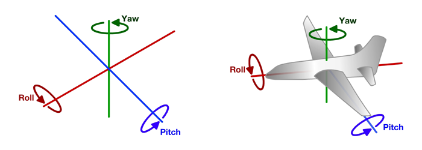
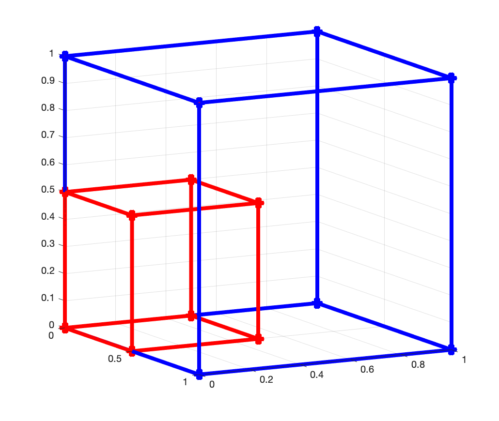

# 3-D (Linear) Geometric Transformations


## Overview

These notes introduce the concept of 3-D linear transformations. Three-dimensional transformations are direct extensions of their 2-D counterparts. Here, we will present only some basic transformations such as scaling, rotation, and shear.  

## Three-dimensional linear transformations 

As expected, a 3-D linear transformation maps three-dimensional points ${\bf x} = (x,y,z)^\mathsf{T}$ onto three-dimensional points ${\bf x}^\prime = (x^\prime,y^\prime,z^\prime)^\mathsf{T}$. Thus, we can write the transformation as a function $f:\mathbb{R}^3 \rightarrow \mathbb{R}^3$ such that:

$$
\begin{align}
		x^\prime = f_1(x,y,z) = a_1 x + a_2 y + a_3 z, \notag \\
		y^\prime = f_2(x,y,z) = a_4 x + a_5 y + a_6 z, \notag \\
		z^\prime = f_3(x,y,z) = a_7 x + a_8 y + a_9 z.
		\label{2Dlinear}
\end{align}
$$

This 3-D linear transformation consists of three separate equations, each resulting in one component (or coordinate) of the transformed point. The values $a_i$ are the parameters of the transformation. 

We can write it as a linear combination of vectors: 

$$
\begin{align}
	\begin{bmatrix}
		x^\prime\\
		y^\prime\\
		z^\prime 
	\end{bmatrix}
  &= x
	\begin{bmatrix}
		a_1\\
		a_4\\
		a_7	
	\end{bmatrix}
	+ y
	\begin{bmatrix}
		a_2\\
		a_5\\
		a_8		
	\end{bmatrix}
	+ z
	\begin{bmatrix}
		a_3\\
		a_6\\
		a_9		
	\end{bmatrix} 
	= \boldsymbol{\alpha}_1\, x + \boldsymbol{\alpha}_2\, y+ \boldsymbol{\alpha}_3\, z. 
		\label{linearcomb3}
\end{align}
$$

And also in matrix form:

$$
\begin{align}
    \begin{bmatrix}    x^\prime \\    y^\prime \\       z^\prime   \end{bmatrix}   
    &=		\boldsymbol{\alpha}_1\, x + \boldsymbol{\alpha}_2\, y+ \boldsymbol{\alpha}_3\, z 
		\\&=
		\begin{bmatrix}
		\boldsymbol{\alpha}_1 & \boldsymbol{\alpha}_2 & \boldsymbol{\alpha}_3
	\end{bmatrix}	
	\begin{bmatrix}
		x \\
		y \\
		z
	\end{bmatrix}	 	
	=
	\underbrace{\begin{bmatrix}
		a_1 & a_2 & a_3\\
		a_4 & a_5& a_6\\
		a_7 & a_8 &a_9		
	\end{bmatrix}}_{A}
	\begin{bmatrix}
		x \\
		y \\
		z
	\end{bmatrix}.	
\end{align}
$$

or, in short:

$$
\begin{align}
	{\bf x}^\prime = A{\bf x},
	\label{linearND}
\end{align}
$$

where matrix $A$ encodes the transformation.

## Some important 3-D geometric transformations 

Scaling:

$$
\begin{align}
	S = 
	\begin{bmatrix}
		s_x & 0 & 0 \\
		0 & s_y & 0 \\
		0 &   0 & s_z
	\end{bmatrix}. 
\end{align}
$$

Rotations (about the $x$-axis, $y$-axis, and $z$-axis):

$$
\begin{align}
	R_x = 
	\begin{bmatrix}
	    1 &           0 &           0 \\
		  0 &  \cos\theta & -\sin\theta \\
		  0 &  \sin\theta &  \cos\theta 
	\end{bmatrix},
\end{align}
$$

$$
\begin{align}
	R_y = 
	\begin{bmatrix}
	    \cos\theta &           0 &  \sin\theta \\
		  0          &           1 &           0 \\
		 -\sin\theta &           0 &  \cos\theta 
	\end{bmatrix},
\end{align}
$$

$$
\begin{align}
	R_z = 
	\begin{bmatrix}
		  \cos\theta & -\sin\theta & 0\\
		  \sin\theta &  \cos\theta & 0\\
	             0 &           0 & 1
	\end{bmatrix}.
\end{align}
$$

By multiplying these matrices, we can obtain general rotations such as: 

$$
R = R_z\,R_y\,R_x = 
  \underbrace{\begin{bmatrix}
		  \cos\theta & -\sin\theta & 0\\
		  \sin\theta &  \cos\theta & 0\\
	             0 &           0 & 1
	\end{bmatrix}}_{\text{yaw}}
	\underbrace{\begin{bmatrix}
	    \cos\theta &           0 &  \sin\theta \\
		  0          &           1 &           0 \\
		 -\sin\theta &           0 &  \cos\theta 
	\end{bmatrix}}_{\text{pitch}}
 	\underbrace{\begin{bmatrix}
	    1 &           0 &           0 \\
		  0 &  \cos\theta & -\sin\theta \\
		  0 &  \sin\theta &  \cos\theta 
	\end{bmatrix}}_{\text{roll}}.
$$



Figure from https://www.touringmachine.com/Articles/aircraft/6/

## Example 

###Transforming a 3-D shape 

The following matrix stores the 8 vertices of a rectangular prism:

$$
\begin{align} 
  X = 
  \begin{bmatrix}      
  	0 & 0 & 0 & 0 & 1 & 1 & 1 & 1\\
  	0 & 0 & 1 & 1 & 0 & 0 & 1 & 1\\
    0 & 1 & 0 & 1 & 0 & 1 & 0 & 1
  \end{bmatrix}.   
\end{align}
$$

We can scale the shape by half as follows:

$$
\begin{align}
   X^\prime &= S\,X \notag\\
   &= 
   \begin{bmatrix}
	1/2 & 0 & 0 \\
	0 & 1/2 & 0 \\
	0 &   0 & 1/2
  \end{bmatrix} 	
  \begin{bmatrix}      
  	0 & 0 & 0 & 0 & 1 & 1 & 1 & 1\\
  	0 & 0 & 1 & 1 & 0 & 0 & 1 & 1\\
    	0 & 1 & 0 & 1 & 0 & 1 & 0 & 1
  \end{bmatrix}   
\notag \\
	&=
\begin{bmatrix}
	0 & 0 & 0 & 0 & \frac{1}{2} & \frac{1}{2} & \frac{1}{2} & \frac{1}{2}\\ 
	0 & 0 & \frac{1}{2} & \frac{1}{2} & 0 & 0 & \frac{1}{2} & \frac{1}{2}\\ 
	0 & \frac{1}{2} & 0 & \frac{1}{2} & 0 & \frac{1}{2} & 0 & \frac{1}{2}
\end{bmatrix}.
\end{align}
$$

### Matlab basic code:

```matlab
% The shape to be transformed  (transposed)
pts = [ 0.0  0.0  0.0;    % 1
        0.0  0.0  1.0;    % 2
        0.0  1.0  0.0;    % 3
        0.0  1.0  1.0;    % 4
        1.0  0.0  0.0;    % 5
        1.0  0.0  1.0;    % 6
        1.0  1.0  0.0;    % 7
        1.0  1.0  1.0 ]'  % 8 
    
% Transformation matrix (scaling)
S_tilde = [ 0.5 0.0 0.0;
            0.0 0.5 0.0;
            0.0 0.0 0.5];     
        
% Apply transformation 
pts_prime = S_tilde * pts
```

Plot: 



### Whole code (with plotting functions)

```matlab
function display_cube()
%
% This function displays a 3-D cube. 
%

% The shape to be transformed  
pts = [ 0.0  0.0  0.0;    % 1
        0.0  0.0  1.0;    % 2
        0.0  1.0  0.0;    % 3
        0.0  1.0  1.0;    % 4
        1.0  0.0  0.0;    % 5
        1.0  0.0  1.0;    % 6
        1.0  1.0  0.0;    % 7
        1.0  1.0  1.0 ]'  % 8 

    
% Create a new figure dialog and set the background color to white.      
figure; 
set(gcf, 'color','w');     
set(gcf, 'Position', [0, 0, 100, 100])
    
% Show original shape in blue
showCube(pts,'b');  
view(62,11)  

% Transformation matrix (scaling)
S_tilde = [ 0.5 0.0 0.0;
            0.0 0.5 0.0;
            0.0 0.0 0.5]; 


% Apply transformation 
pts_prime = S_tilde * pts; 

% Show transformed shape in red
hold on;
showCube(pts_prime,'r');   

view(62,11)  
return 


function showCube(x, c )  
%% showCube 
%
% This function plots the cube shape in 3-D. 
%
% Input: 
%   x: (x,y,z) coordinates as 3xM matrix 
%   c: line color 
%
%


hold on;
    
% Indices of bottom square  
idx1 = [ 1 5 7 3 1 ];   
plot3(x(1,idx1),x(2,idx1),x(3,idx1),'Color',c, 'Marker','o','LineWidth',4);
  
% Indices of top square
idx2 = [ 2 6 8 4 2 ];   
plot3(x(1,idx2),x(2,idx2),x(3,idx2),'Color',c, 'Marker','o','LineWidth',4);
 
% Link the two squares
plot3(x(1,1:2),x(2,1:2),x(3,1:2),'Color',c, 'Marker','o','LineWidth',4, 'MarkerSize', 8, 'MarkerFaceColor','r');
plot3(x(1,5:6),x(2,5:6),x(3,5:6),'Color',c, 'Marker','o','LineWidth',4, 'MarkerSize', 8, 'MarkerFaceColor','r');
plot3(x(1,7:8),x(2,7:8),x(3,7:8),'Color',c, 'Marker','o','LineWidth',4, 'MarkerSize', 8, 'MarkerFaceColor','r');
plot3(x(1,3:4),x(2,3:4),x(3,3:4),'Color',c, 'Marker','o','LineWidth',4, 'MarkerSize', 8, 'MarkerFaceColor','r');


hold off; 

return 
```

